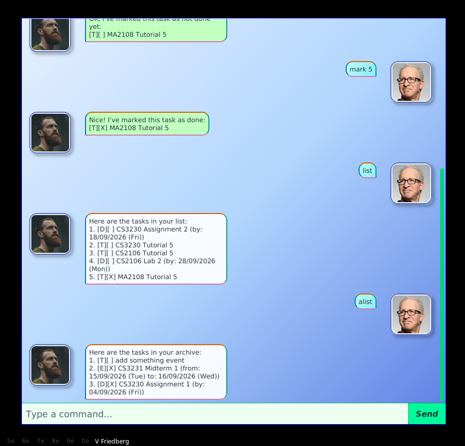
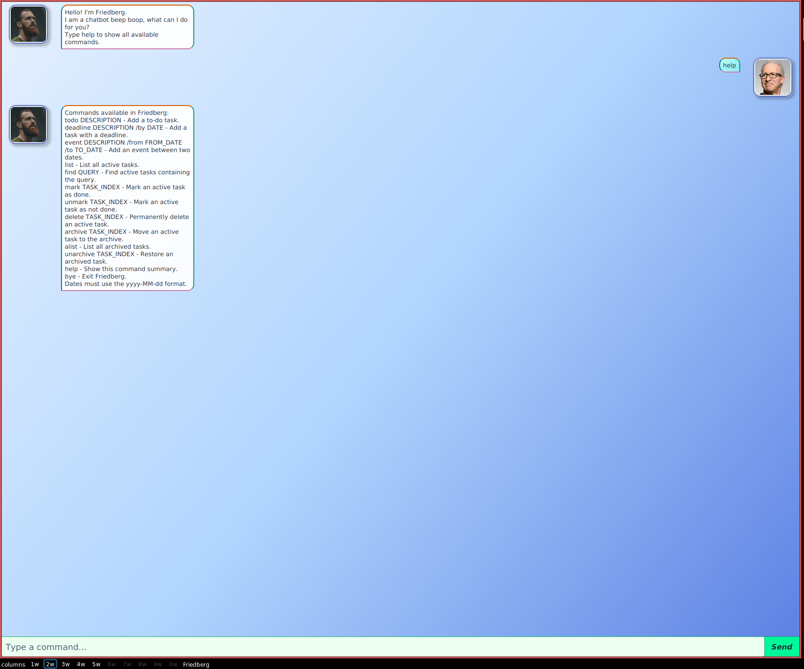
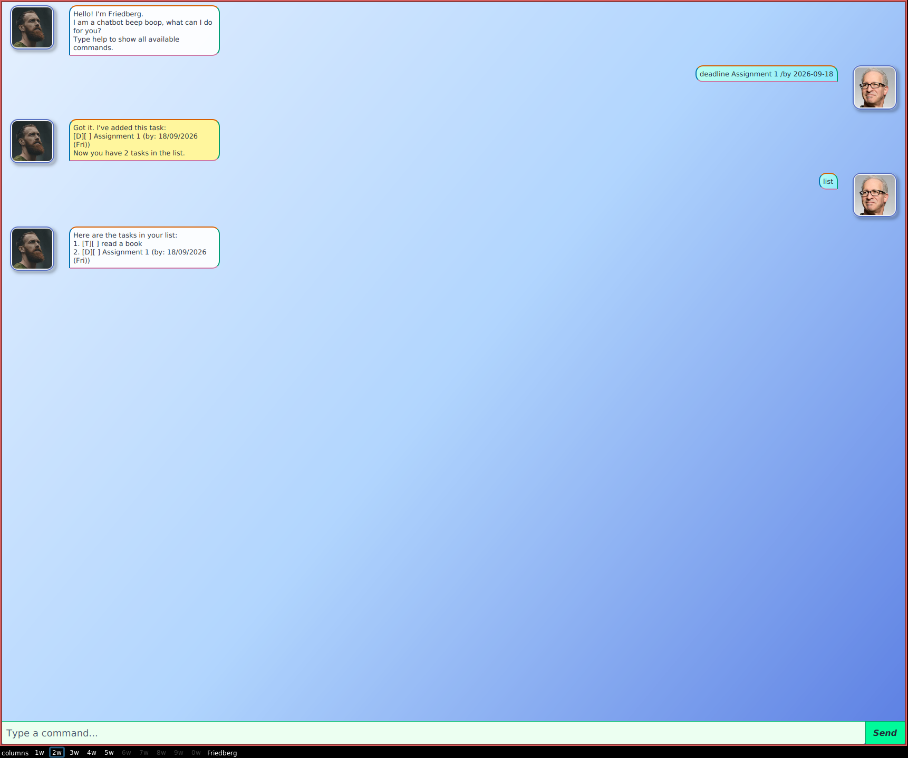
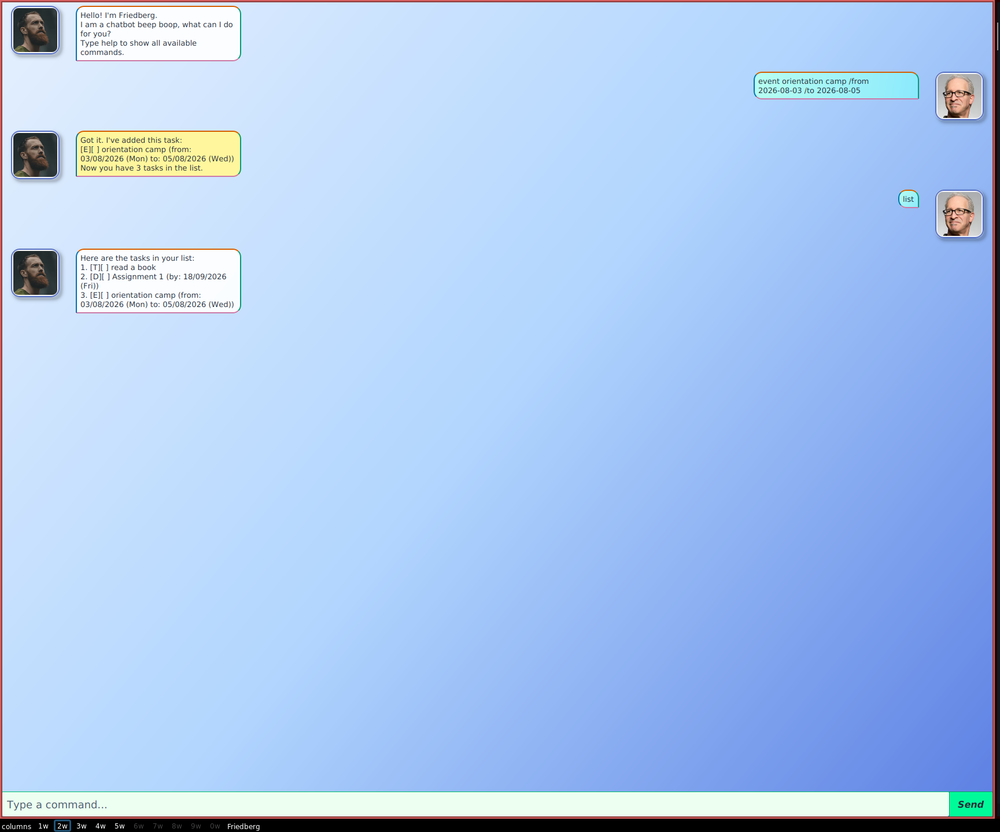
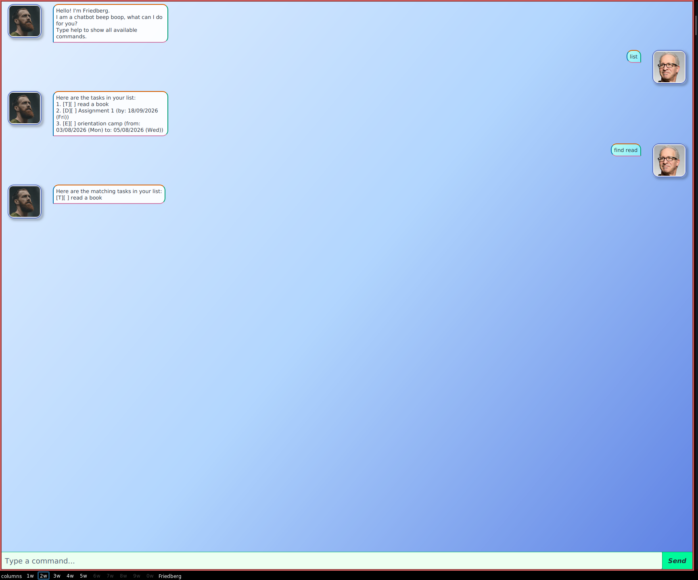
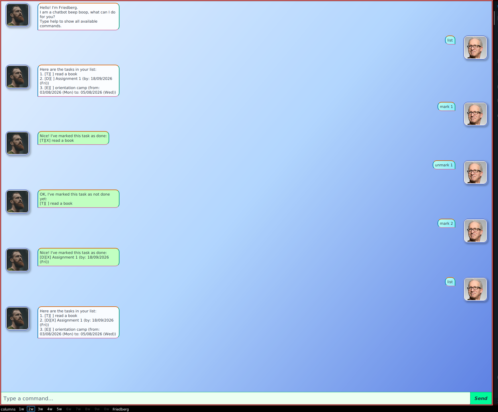
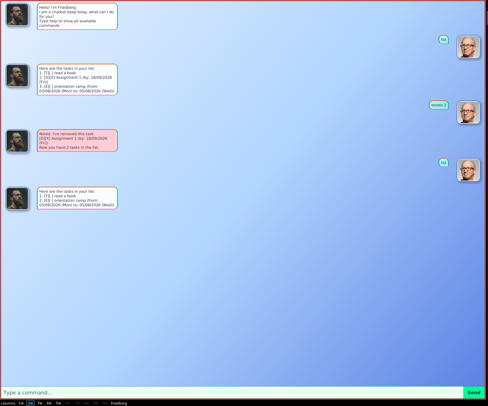
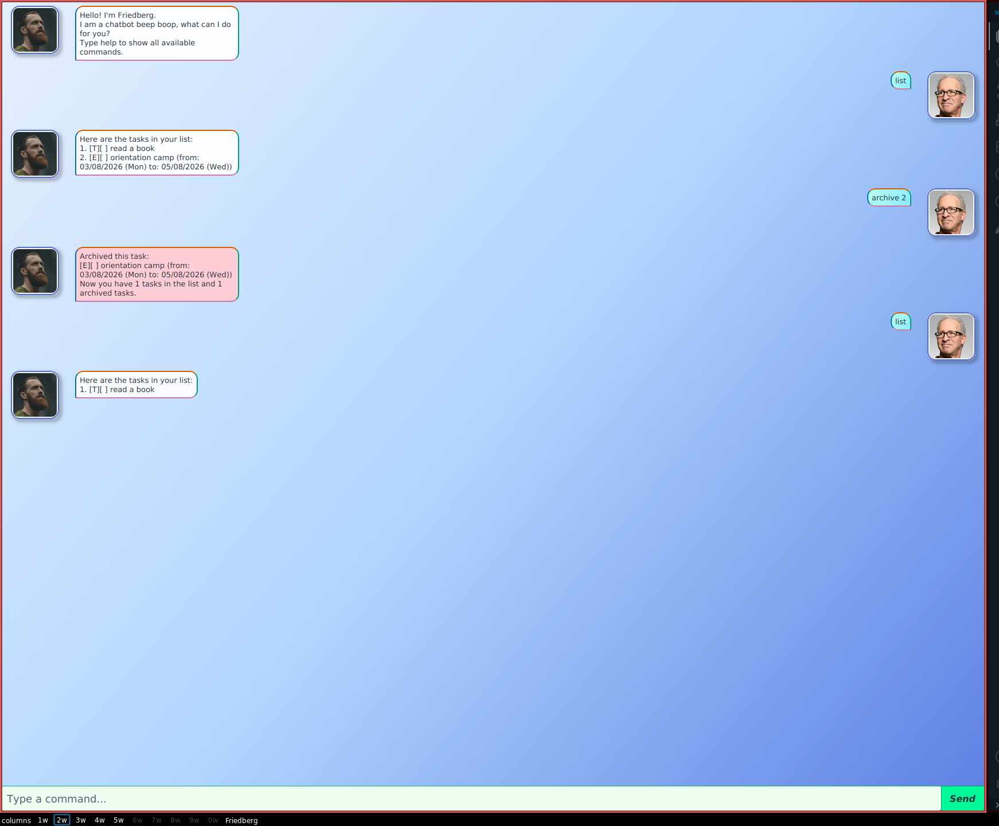
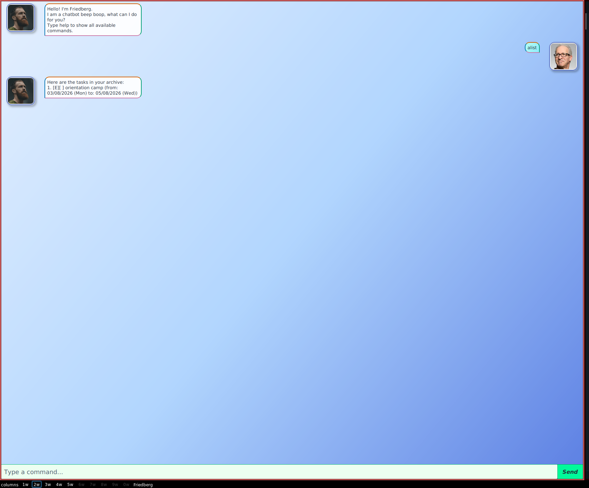
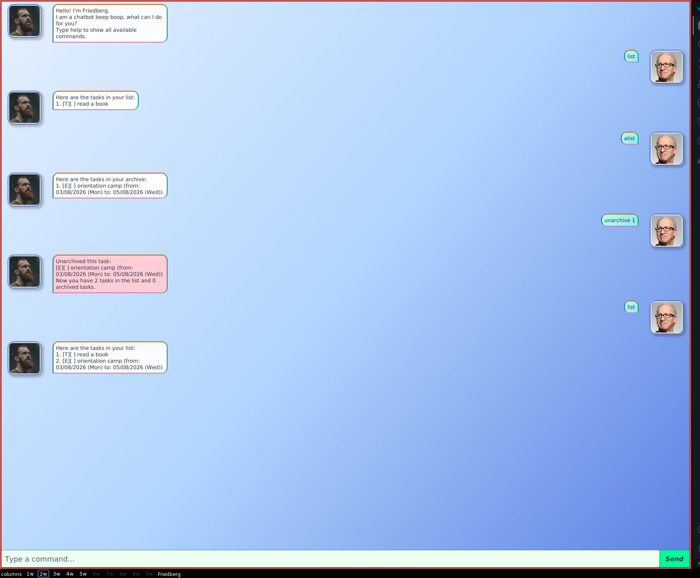

# Friedberg User Guide

Friedberg is a desktop task-management chatbot for users who prefer typing commands instead of navigating complex menus. It supports to-dos, deadlines, events, task completion tracking, searching, and archiving.

Friedberg provides both a JavaFX graphical interface and a command-line interface. Your tasks are saved automatically, so they remain available the next time you launch the application.



---

## Table of contents

- [Friedberg User Guide](#friedberg-user-guide)
  - [Table of contents](#table-of-contents)
  - [Quick start](#quick-start)
    - [Running the CLI during development](#running-the-cli-during-development)
  - [Reading this guide](#reading-this-guide)
    - [Important notes about task indexes](#important-notes-about-task-indexes)
  - [Features](#features)
    - [Viewing command help: `help`](#viewing-command-help-help)
    - [Adding a to-do: `todo`](#adding-a-to-do-todo)
    - [Adding a deadline: `deadline`](#adding-a-deadline-deadline)
    - [Adding an event: `event`](#adding-an-event-event)
    - [Listing active tasks: `list`](#listing-active-tasks-list)
    - [Finding tasks: `find`](#finding-tasks-find)
    - [Marking a task as done: `mark`](#marking-a-task-as-done-mark)
    - [Marking a task as not done: `unmark`](#marking-a-task-as-not-done-unmark)
    - [Deleting a task: `delete`](#deleting-a-task-delete)
    - [Archiving a task: `archive`](#archiving-a-task-archive)
    - [Listing archived tasks: `alist`](#listing-archived-tasks-alist)
    - [Unarchiving a task: `unarchive`](#unarchiving-a-task-unarchive)
    - [Exiting Friedberg: `bye`](#exiting-friedberg-bye)
  - [Command format and validation](#command-format-and-validation)
    - [Spacing rules](#spacing-rules)
    - [Required parameters](#required-parameters)
    - [Duplicate parameters](#duplicate-parameters)
    - [Index rules](#index-rules)
    - [Date rules](#date-rules)
    - [Description and query characters](#description-and-query-characters)
  - [Understanding task display](#understanding-task-display)
    - [Task type markers](#task-type-markers)
    - [Completion markers](#completion-markers)
  - [Saving data](#saving-data)
  - [Editing data files](#editing-data-files)
  - [FAQ](#faq)
    - [Q: How do I know which task index to use?](#q-how-do-i-know-which-task-index-to-use)
    - [Q: Why did my task index change?](#q-why-did-my-task-index-change)
    - [Q: Is deleting the same as archiving?](#q-is-deleting-the-same-as-archiving)
    - [Q: Where does an unarchived task go?](#q-where-does-an-unarchived-task-go)
    - [Q: Are completed tasks allowed in the archive?](#q-are-completed-tasks-allowed-in-the-archive)
    - [Q: Why was my date rejected even though it looked correctly formatted?](#q-why-was-my-date-rejected-even-though-it-looked-correctly-formatted)
    - [Q: Can an event start and end on the same date?](#q-can-an-event-start-and-end-on-the-same-date)
    - [Q: Why does Friedberg reject extra spaces?](#q-why-does-friedberg-reject-extra-spaces)
    - [Q: Can I search archived tasks?](#q-can-i-search-archived-tasks)
    - [Q: How do I view all available commands?](#q-how-do-i-view-all-available-commands)
    - [Q: How do I transfer my tasks to another computer?](#q-how-do-i-transfer-my-tasks-to-another-computer)
  - [Known limitations](#known-limitations)
  - [Command summary](#command-summary)

---

## Quick start

1. Ensure that **Java 25** is installed on your computer.
2. Download the latest Friedberg JAR file.
3. Place the JAR file in the folder where you want Friedberg to store its data.
4. Open a terminal in that folder.
5. Run the graphical application:

   ```bash
   java -jar gui.jar
   ```

6. Type a command in the input field and press <kbd>Enter</kbd> or click **Send**.
7. Try adding and displaying a task:

   ```text
   todo read a book
   list
   ```


### Running the CLI during development

From the project directory, run:

```bash
./gradlew runCli
```

To run the JavaFX GUI during development:

```bash
./gradlew run
```

Both interfaces support the same commands and use the same validation rules.

---

## Reading this guide

The following conventions are used in command formats:

- Words written in lowercase, such as `todo` or `mark`, must be entered exactly as shown.
- Words in uppercase, such as `DESCRIPTION`, `DATE`, and `TASK_INDEX`, are values supplied by you.
- Do not type the uppercase placeholder itself.
- Commands are case-sensitive.
- Commands require exactly one space between each part.
- Leading and trailing spaces are not allowed.

For example, this format:

```text
deadline DESCRIPTION /by DATE
```

can be used as:

```text
deadline submit project report /by 2026-09-10
```

### Important notes about task indexes

- Task indexes begin at `1`.
- Use `list` before commands that operate on the active task list.
- Use `alist` before `unarchive`, because archived tasks have their own indexes.
- Indexes can change after deleting, archiving, or unarchiving a task.

---

## Features

### Viewing command help: `help`

Displays all commands supported by Friedberg together with a brief description of what each command does.

**Format:**

```text
help
```

The command summary includes the required format for adding, listing, finding, updating, deleting, archiving, and restoring tasks, as well as exiting Friedberg.

`help` does not accept additional parameters.



---

### Adding a to-do: `todo`

Adds a task that does not have a date.

**Format:**

```text
todo DESCRIPTION
```

**Examples:**

```text
todo read a book
todo buy groceries
todo review chapter 3
```

A newly added to-do is shown with the type marker `[T]` and is initially not completed:

```text
[T][ ] read a book
```


---

### Adding a deadline: `deadline`

Adds a task that must be completed by a particular date.

**Format:**

```text
deadline DESCRIPTION /by DATE
```

`DATE` must use the exact `yyyy-MM-dd` format.

**Examples:**

```text
deadline submit project report /by 2026-09-10
deadline renew library book /by 2026-12-01
```

Friedberg displays the date in a more readable format:

```text
[D][ ] submit project report (by: 10/09/2026 (Thu))
```

The `/by` parameter is required and must appear exactly once.

Invalid or nonexistent dates are rejected. For example:

```text
deadline submit report /by 2026-02-30
```



---

### Adding an event: `event`

Adds a task that takes place between two dates.

**Format:**

```text
event DESCRIPTION /from FROM_DATE /to TO_DATE
```

Both dates must use the exact `yyyy-MM-dd` format. `FROM_DATE` must be earlier than `TO_DATE`.

**Examples:**

```text
event orientation camp /from 2026-08-03 /to 2026-08-05
event project workshop /from 2026-09-10 /to 2026-09-11
```

Example display:

```text
[E][ ] orientation camp (from: 03/08/2026 (Mon) to: 05/08/2026 (Wed))
```

The `/from` and `/to` parameters:

- are both required;
- must each appear exactly once;
- must appear in that order;
- must contain real calendar dates;
- cannot contain equal dates;
- cannot have a start date after the end date.

Invalid example:

```text
event orientation camp /from 2026-08-03 /to 2026-08-05
```



---

### Listing active tasks: `list`

Displays every task in the active task list.

**Format:**

```text
list
```

Example output:

```text
Here are the tasks in your list:
1. [T][ ] read a book
2. [D][X] submit project report (by: 10/09/2026 (Thu))
3. [E][ ] orientation camp (from: 03/08/2026 (Mon) to: 05/08/2026 (Wed))
```

The displayed number is the `TASK_INDEX` used by `mark`, `unmark`, `delete`, and `archive`.

`list` does not accept additional parameters.


---

### Finding tasks: `find`

Displays active tasks whose descriptions contain the given search query.

**Format:**

```text
find QUERY
```

**Examples:**

```text
find book
find project
```

If the active task list contains `read a book` and `renew library book`, then:

```text
find book
```

returns both tasks.

The search:

- checks active tasks only;
- matches text contained anywhere in the description;
- is case-sensitive;
- requires a non-empty query.

If nothing matches, Friedberg responds:

```text
There are no tasks matching your search.
```



---

### Marking a task as done: `mark`

Marks an active task as completed.

**Format:**

```text
mark TASK_INDEX
```

**Example:**

```text
list
mark 2
```

If task `2` is a deadline, its completion marker changes from `[ ]` to `[X]`:

```text
[D][X] submit project report (by: 10/09/2026 (Thu))
```

The index must refer to a task currently shown by `list`.



---

### Marking a task as not done: `unmark`

Changes a completed active task back to not completed.

**Format:**

```text
unmark TASK_INDEX
```

**Example:**

```text
unmark 2
```

The task's completion marker changes from `[X]` to `[ ]`.

The index must refer to a task currently shown by `list`.

---

### Deleting a task: `delete`

Permanently removes a task from the active task list.

**Format:**

```text
delete TASK_INDEX
```

**Example:**

```text
list
delete 1
```

Friedberg displays the deleted task and the updated number of active tasks.

> [!CAUTION]
> Deleting is permanent. If you may need the task later, use `archive` instead.



---

### Archiving a task: `archive`

Moves a task from the active task list to the archive without deleting it.

**Format:**

```text
archive TASK_INDEX
```

**Example:**

```text
list
archive 2
```

After archiving:

- the task is removed from `list`;
- the task is appended to the archived task list;
- its type, description, dates, and completion status are preserved;
- it can be viewed with `alist`;
- it can be restored with `unarchive`.

The index must refer to a task currently shown by `list`.



---

### Listing archived tasks: `alist`

Displays every task in the archive.

**Format:**

```text
alist
```

Example output:

```text
Here are the tasks in your archive:
1. [T][ ] read a book
2. [D][X] submit project report (by: 10/09/2026 (Thu))
```

The displayed number is the archive `TASK_INDEX` used by `unarchive`.

`alist` does not accept additional parameters.



---

### Unarchiving a task: `unarchive`

Moves a task from the archive back to the active task list.

**Format:**

```text
unarchive TASK_INDEX
```

**Example:**

```text
alist
unarchive 1
```

The restored task:

- is removed from the archive;
- is added to the end of the active task list;
- retains its type, description, dates, and completion status.

The index must refer to a task currently shown by `alist`, not `list`.



---

### Exiting Friedberg: `bye`

Closes Friedberg.

**Format:**

```text
bye
```

Friedberg responds:

```text
Bye bye, see you again next time.
```

`bye` does not accept additional parameters.

---

## Command format and validation

Friedberg uses strict command formatting to detect mistakes early and avoid executing an unintended command.

### Spacing rules

Use exactly one regular space between command parts.

Valid:

```text
todo read a book
mark 1
```

Invalid:

```text
 todo read a book
todo read a book
todo  read a book
todo→read a book
```

In the last example, `→` represents a tab. Tabs and line breaks are not accepted as command separators.

### Required parameters

Essential parameters cannot be omitted.

Invalid examples:

```text
todo
deadline submit report
event project meeting /from 2026-09-10
mark
```

### Duplicate parameters

Date parameters must occur exactly once.

Invalid examples:

```text
deadline submit report /by 2026-09-10 /by 2026-09-11
event camp /from 2026-08-03 /from 2026-08-04 /to 2026-08-05
```

### Index rules

A `TASK_INDEX` must:

- contain digits only;
- be at least `1`;
- refer to an existing task in the relevant list.

Invalid indexes include:

```text
0
-1
+1
1.5
one
1!
```

### Date rules

Dates must:

- use exactly four year digits, two month digits, and two day digits;
- use hyphens as separators;
- represent a real date.

Valid:

```text
2024-02-29
2026-09-10
```

Invalid:

```text
2026/09/10
2026-9-10
2025-02-29
2026-04-31
2026-13-01
```

### Description and query characters

Descriptions and search queries:

- must begin with a letter or number;
- may contain letters, numbers, regular spaces, periods, apostrophes, question marks, exclamation marks, parentheses, ampersands, plus signs, and hyphens;
- cannot contain commas because commas are reserved by Friedberg's storage format;
- cannot contain slashes because slash-prefixed text is reserved for command parameters;
- cannot contain control characters or line breaks.

Examples of accepted descriptions:

```text
todo read chapter 3
todo review Alice's report
todo prepare slides (part-2)
```

Examples of rejected descriptions:

```text
todo buy bread, milk
todo read CS2103/T notes
```

---

## Understanding task display

Every task starts with two markers.

### Task type markers

| Marker | Task type |
| --- | --- |
| `[T]` | To-do |
| `[D]` | Deadline |
| `[E]` | Event |

### Completion markers

| Marker | Meaning |
| --- | --- |
| `[ ]` | Not completed |
| `[X]` | Completed |

Example:

```text
[D][X] submit project report (by: 10/09/2026 (Thu))
```

This is a completed deadline.

---

## Saving data

Friedberg saves changes automatically after commands that modify tasks.

Saved operations include:

- adding a task;
- marking or unmarking a task;
- deleting a task;
- archiving a task;
- unarchiving a task.

By default, Friedberg stores data in:

```text
data/friedberg_data
data/friedberg_archive
```

- `friedberg_data` contains active tasks.
- `friedberg_archive` contains archived tasks.

The `data` directory and files are created automatically if they do not exist.

You do not need to run a separate save command.

---

## Editing data files

> [!WARNING]
> Editing Friedberg's data files manually can corrupt your saved tasks and prevent the application from starting.

If you choose to edit them:

1. Exit Friedberg first.
2. Make a backup of the entire `data` directory.
3. Do not add commas or extra line breaks to task descriptions.
4. Preserve the existing serialized field order.
5. Restore the backup if Friedberg reports a startup data error.

For normal use, modify tasks through Friedberg commands instead.

---

## FAQ

### Q: How do I know which task index to use?

Run `list` before `mark`, `unmark`, `delete`, or `archive`. Run `alist` before `unarchive`.

### Q: Why did my task index change?

Indexes reflect the task's current position. Deleting, archiving, or unarchiving tasks can change subsequent indexes.

### Q: Is deleting the same as archiving?

No. `delete` permanently removes an active task. `archive` stores it in a separate list so it can be restored later.

### Q: Where does an unarchived task go?

It is appended to the end of the active task list, like a newly added task.

### Q: Are completed tasks allowed in the archive?

Yes. Archiving and unarchiving preserve the task's completion status.

### Q: Why was my date rejected even though it looked correctly formatted?

The date must both match `yyyy-MM-dd` and exist on the calendar. For example, `2025-02-29` has the correct shape but is not a real date.

### Q: Can an event start and end on the same date?

No. Friedberg currently requires the `/from` date to be strictly earlier than the `/to` date.

### Q: Why does Friedberg reject extra spaces?

Friedberg uses strict command formatting to identify malformed commands clearly. Use exactly one regular space between command parts and do not add spaces at the beginning or end.

### Q: Can I search archived tasks?

Not currently. `find` searches the active task list only. Use `alist` to view archived tasks.

### Q: How do I view all available commands?

Enter:

```text
help
```

Friedberg will display every command together with its format and a brief description.

### Q: How do I transfer my tasks to another computer?

Exit Friedberg and copy the complete `data` directory together with the application. Keep both `friedberg_data` and `friedberg_archive`.

---

## Known limitations

- Commands are case-sensitive and must be entered in lowercase.
- Strict spacing is required; Friedberg does not automatically trim or collapse whitespace.
- Dates contain days only; times of day are not supported.
- Events cannot start and end on the same date.
- `find` is case-sensitive and searches active tasks only.
- Task descriptions cannot contain commas or slashes due to command and storage syntax.
- Tasks cannot currently be edited after creation; delete and recreate a task if its description or date is wrong.
- Archived tasks cannot be marked, unmarked, searched, or deleted directly. Unarchive them first.

---

## Command summary

| Action | Format | Example |
| --- | --- | --- |
| Show command help | `help` | `help` |
| Add a to-do | `todo DESCRIPTION` | `todo read a book` |
| Add a deadline | `deadline DESCRIPTION /by DATE` | `deadline submit report /by 2026-09-10` |
| Add an event | `event DESCRIPTION /from FROM_DATE /to TO_DATE` | `event camp /from 2026-08-03 /to 2026-08-05` |
| List active tasks | `list` | `list` |
| Find active tasks | `find QUERY` | `find book` |
| Mark as done | `mark TASK_INDEX` | `mark 2` |
| Mark as not done | `unmark TASK_INDEX` | `unmark 2` |
| Delete permanently | `delete TASK_INDEX` | `delete 1` |
| Archive | `archive TASK_INDEX` | `archive 3` |
| List archived tasks | `alist` | `alist` |
| Restore archived task | `unarchive TASK_INDEX` | `unarchive 1` |
| Exit | `bye` | `bye` |
